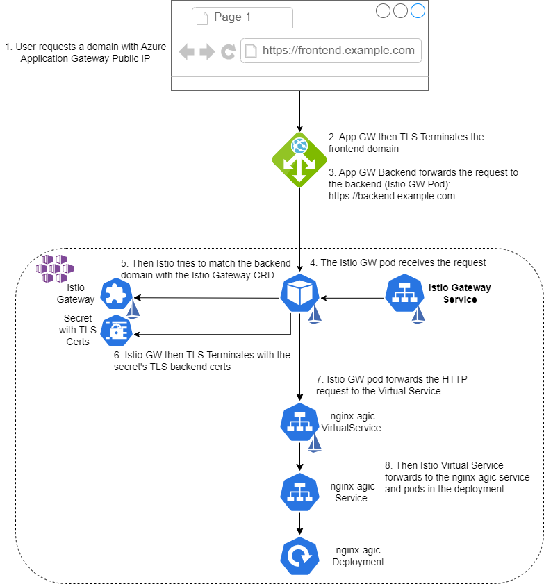

# Guide to Setting Up Azure Application Gateway with AGIC and Istio Gateway as Backend with TLS

## Introduction

This guide aims to provide detailed instructions on setting up an Azure Application Gateway with the Application Gateway Ingress Controller (AGIC) and utilizing Istio Gateway as the backend. It addresses the lack of comprehensive resources available on this specific configuration. By following this proof of concept, you will gain the knowledge required to successfully implement and integrate these components.

Here's a diagram showcasing what we are trying to achieve with all resources:



## Prerequisites

- Azure Subscription
- Azure CLI
- Terraform
- kubectl
- helm

## Configuration

The [terraform.tfvars](terraform/terraform.tfvars) has all the relevant configurations.

> Warning: Make sure you carefully check all the configurations and Terraform files. The Azure Application Gateway is using [WAF_v2 SKU](terraform/appgw.tf) which adds additional charges. 

## Installation

### Deploy Azure Resources

> Note: Make sure you change the tfvars to your needs
```sh
cd terraform

terraform init
terraform apply
```

### Deploy Istio

Follow the official documentation on installing istio. Make sure you install the `istio gateway` so you can configure the Istio's services to link the AGIC Ingress to.

The Istio service can be a `ClusterIP` since its not going to be accessed outside the cluster. The way App GW connects is by the pod ips directly and not by the service itself. You can verify this when you open the backend pools in Azure Portal (after AGIC Add-on is enabled in the AKS Cluster) and created all resources mentioned below.

```sh
helm repo add istio https://istio-release.storage.googleapis.com/charts
helm repo update

kubectl create ns istio-system
helm install -n istio-system istio-base istio/base
helm install -n istio-system istiod istio/istiod --wait

kubectl create ns istio-ingress
helm install -n istio-ingress istio-gateway istio/gateway -f charts/values/values-gateway-agic.yaml --wait # Installs istio k8s services as ClusterIP
```

### Create sync secret tool (akv2k8s)

Terraform will create the certificate and place it in Azure key vault. This certificate is referenced by Azure Application Gateway in [trusted_root_certificates](terraform/appgw.tf) block.
Also, we will need to reference this certificate in Istio Gateway. To do this, we use a sync secret tool [akv2k8s](https://akv2k8s.io/installation/on-azure-aks).

Install:
```sh
kubectl create ns akv2k8s

helm repo add spv-charts https://charts.spvapi.no
helm repo update
helm upgrade --install akv2k8s spv-charts/akv2k8s --namespace akv2k8s
```

Label the namespace so the akv2k8s controller can start looking for secret syncs:
```sh
kubectl label ns istio-ingress azure-key-vault-env-injection=enabled
```

Later, we will define how the secrets should be retrieved from key vault and where they should be created

### Deploy k8s resources to AKS

The [yamls folder](yamls/) has all the resources needed inside AKS to glue everything together:
- Application Gateway Ingress
- Istio Gateway
- Frontend and Backend TLS certs into k8s secret
- Istio VirtualService
- k8s nginx-service Service
- k8s nginx-agic Deployment


Below we will create all the resources:

```sh
kubectl create ns test-app

kubectl label namespace test-app istio-injection=enabled --overwrite
kubectl apply -f app/.
```


### Install istio's AddOns to monitor the traffic in kiali (optional)

```sh
git clone git@github.com:istio/istio.git
cd istio

kubectl apply -f samples/addons/prometheus.yaml
kubectl apply -f samples/addons/kiali.yaml
```

### Test

Retrieve the Azure Application Gateway Public IP and perform a https request with `frontend.example.com`:
```sh
appgw_public_ip=$(terraform output -raw appgw_public_ip)

curl -v \
     -HHost:frontend.example.com \
     --resolve "frontend.example.com:443:${appgw_public_ip}" \
     --cacert certs/frontend.example.com.crt \
     https://frontend.example.com
```

## Troubleshoot

If the response to the gateway gives a 502 Bad Gateway, you can try narrow down the problem and check if the Istio Gateway is correctly using the backend certificate.

First, we need to retrive the backend certificate from the `istio-ingress` nanmespace:
```sh
kubectl -n istio-ingress get secret backend-tls -o jsonpath="{.data.tls\.crt}" | base64 -d > certs/backend.example.com.crt
```

Create a testing pod:
```sh
kubectl run test-pod --image=nixery.dev/shell/curl/dig/gnutar --restart=Never -- sleep infinity
```
> Note: The `gnutar` is to install the `tar` cli which is a requirement for `kubectl cp` to work.

Copy the certificate to testing pod:
```sh
kubectl cp certs/backend.example.com.crt test-pod:/tmp/backend.example.com.crt
```

Then execute the command below in a pod with curl:
```sh
# Get the Istio Gateway Service ClusterIP
istio_gw_cluster_ip=$(kubectl -n istio-ingress get svc istio-gateway -o template --template="{{.spec.clusterIP}}")

# Run the curl command inside the pod to test if the backend connection to Istio Gateway is working
kubectl exec -it test-pod -- \
     curl -v \
     -HHost:backend.example.com \
     --resolve "backend.example.com:443:$(echo $istio_gw_cluster_ip)" \ 
     --cacert /tmp/backend.example.com.crt \
     https://backend.example.com
```
> Note: The `$(echo $istio_gw_cluster_ip)` is to force to get the env var from the local machine and not get it from inside the pod.

## References

- [Istio Ingress Health Check](https://github.com/istio/istio/issues/9385#issuecomment-466788157)
- [Example deployment of App GW and Istio](https://itnext.io/using-application-gateway-waf-with-istio-315b907b8ed7)
- [Example code for App GW Module](https://github.com/aztfm/terraform-azurerm-application-gateway/blob/main/main.tf)
- [Enable application gateway ingress controller add-on for an existing AKS cluster with an existing application gateway](https://learn.microsoft.com/en-gb/azure/application-gateway/tutorial-ingress-controller-add-on-existing)
- [App GW TLS Termination](https://learn.microsoft.com/en-us/azure/application-gateway/ssl-overview)
- [Generate TLS Certificates with Terraform](https://registry.terraform.io/providers/hashicorp/tls/latest/docs/resources/self_signed_cert)
- [App GW TLS E2E](https://azure.github.io/application-gateway-kubernetes-ingress/tutorials/tutorial.e2e-ssl)
